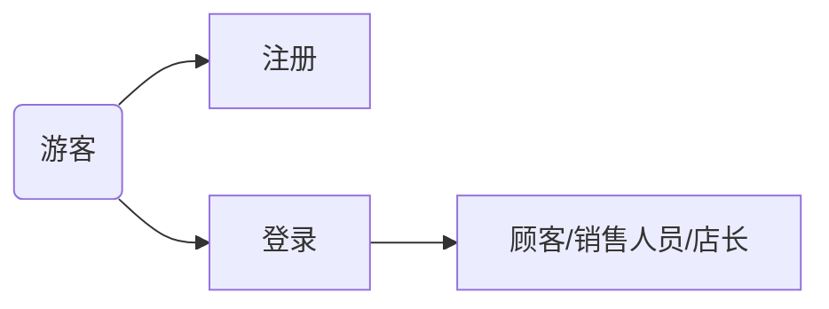
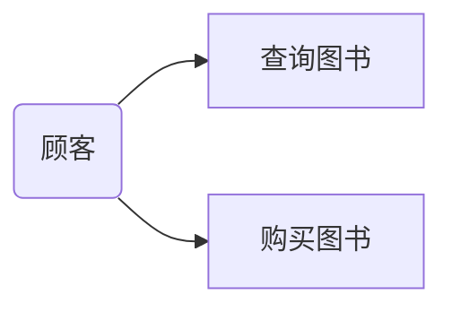
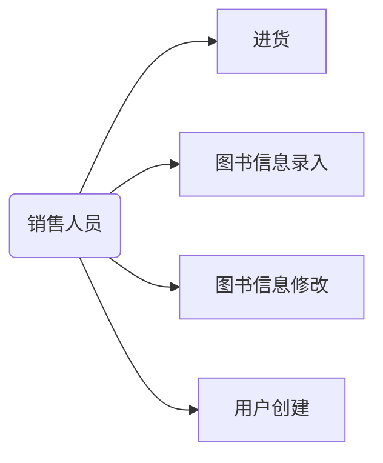
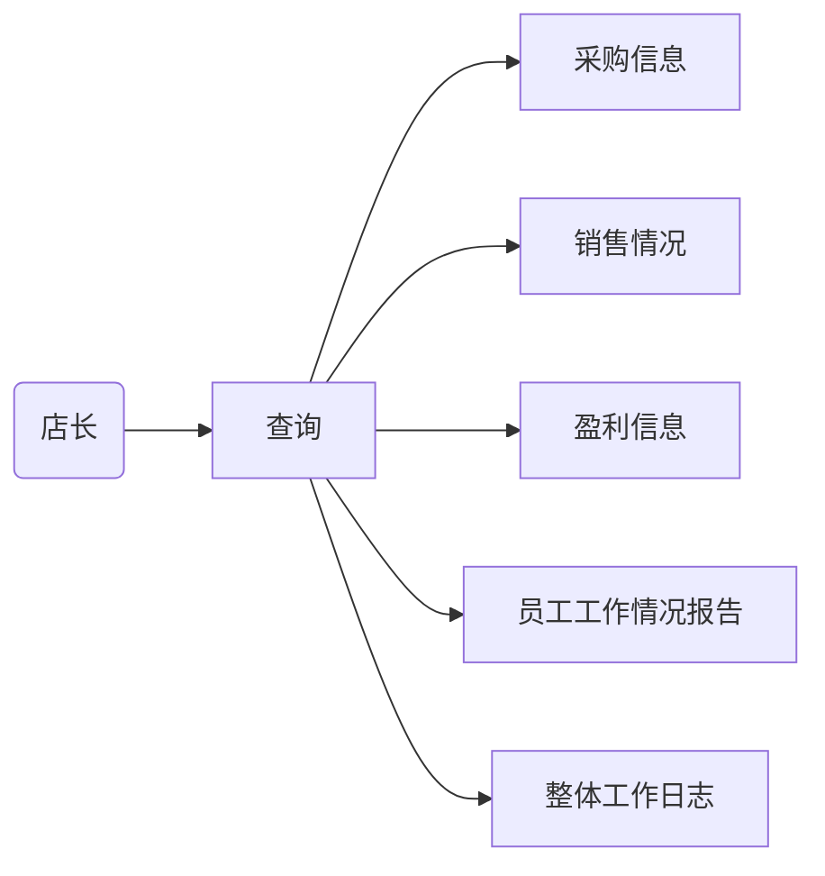
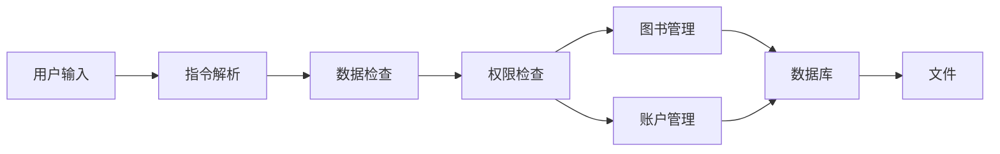

# 需求分析文档

## 业务流图
### 游客

### 顾客

### 销售人员

### 店长

## 数据流图

## 数据词典
1. 用户数据
    + 用户名
    + 密码
    + 权限等级（顾客1，销售人员2，店长3）
2. 图书数据
    + ISBN 号（唯一标识符）
    + 书名
    + 作者
    + 关键字
    + 库存量
    + 单价

## 功能说明
`[x]` 为可选的
1. 登录
    + 输入：`用户名`，`密码`
    + 输出：登录是否成功
    + 处理：登录成功时将登录压入登录栈并切换当前角色
2. 注册
    + 输入：`用户名`，`密码`
    + 输出：注册是否成功
    + 处理：注册成功时将登录压入登录栈并切换当前角色，同时更新用户数据库内数据
3. 更改密码
    + 输入：`用户名`，`[旧密码]`，`新密码`
    + 输出：更改密码是否成功
    + 处理：更改密码成功时更新用户数据库中的密码数据
4. 查询图书
    + 输入：`ISBN 号`，`书名`，`作者`，`关键字` 中的任意组合
    + 输出：查找到的书
5. 购买图书
    + 输入：`ISBN 号`，`购买数量`
    + 输出：购买成功/失败
    + 处理：购买成功时修改图书数据库中的数量
6. 修改图书（图书信息录入）
    + 输入：`ISBN 号`，`书名`，`作者`，`关键字`，`库存量`，`单价`（除创建时外后5均为可选数据）
    + 输出：修改图书数据，若不存在则创建
7. 进货
    + 输入：`ISBN 号`，`数量`，`进货价格`
    + 输出：修改图书数据
8. 日志
    + 采购信息
    + 销售情况
    + 盈利信息
    + 员工工作情况报告
    + 整体工作日志